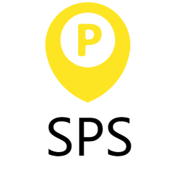
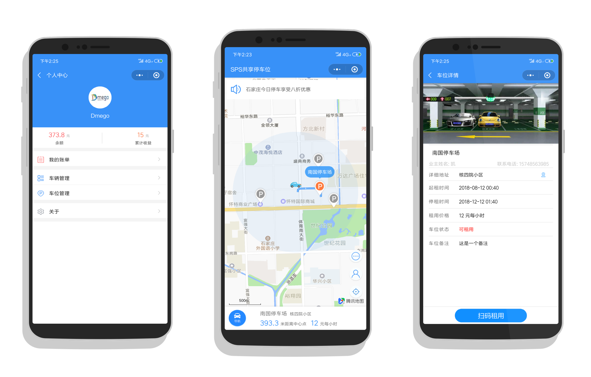

# <div align="center"></div>

<p align="center">«SPS共享停车位» </p>

<p align="center">石家庄铁道大学大学生创新创业训练计划项目</p>

<p align="center">
    <a href="https://github.com/dmego"></a>
    <a href="https://github.com/dmego/sps/releases"></a>
    <a href="https://img.shields.io/github/languages/code-size/dmego/sps.svg"></a>
    <a href="https://github.com/dmego/sps/blob/master/LICENSE"></a>
</p>

## 项目简介

>**SPS**（Share Parking Space）
>将碎片化的车位资源整合分享,解决停车难问题

<div align="center">
    
</div>

## 快速开始

```bash
git clone https://github.com/dmego/sps.git
```

>将`app.js` 里的这行 `Bmob.initialize("9f106xxxxxxx3fxxxx080", "3xxxwehkfsxxxxxsafxxx");` 代码替换成你的应用程序的对应配置秘钥,既`Bmob.initialize("你的Application ID", "你的REST API Key");`

>在你的微信小程序后台配置你的服务器域名,更为具体的配置请查看 [bmob 文档](https://docs.bmob.cn/data/wechatApp/a_faststart/doc/index.html)

>本项目基于 Bmob后端云开发，并且已经上架源码交易，可以免费购买并直接部署。


## 许可证

[](https://github.com/dmego/sps/blob/master/LICENSE)

> 使用GPL-v3.0协议开源，请尽量遵守开源协议。

